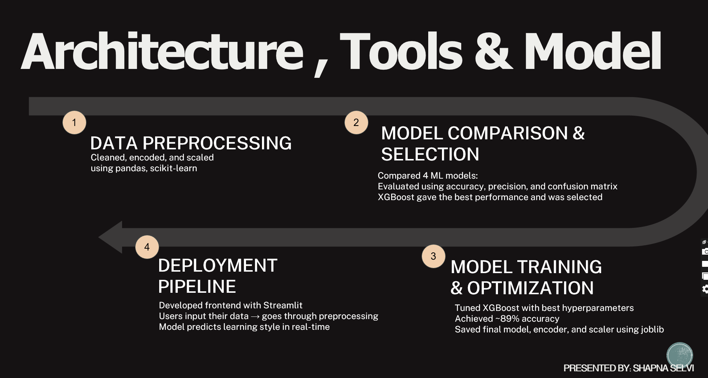

# 🏆 Learning Style Predictor
**1st Place — NextEdge 2025 | AI in Data Analytics | National Conclave @ VSIT (IEEE Bombay Section)**

##  Problem Statement

In many classrooms across India, teachers handle 6+ batches of 40–50 students each with a one-size-fits-all teaching approach. There's no practical way to know:
- Who learns best through **visuals**
- Who prefers **audio** explanations
- Who needs **hands-on**, kinesthetic methods

This disconnect leads to low engagement and poor performance — not because students can't learn, but because we rarely teach the way they learn.

**Trial-and-Error Teaching ≠ Data-Driven Teaching.**


##  Demo

 **[Watch Live Demo on LinkedIn][https://www.linkedin.com/posts/shapna-selvi-0074b6351_1st-place-ai-in-data-analytics-national-activity-7359237995482284032-ax_Y?utm_source=share&utm_medium=member_desktop&rcm=ACoAAFfRI4cB6iKZEZs0wwvXUPBrGQHKZUITFqE]**


##  Architecture




## Solution

An AI-powered tool that predicts a student's learning style — **Visual / Auditory / Kinesthetic** — using simple form inputs and a multiclass ML model. Designed to be lightweight and instantly useful for everyone involved:

| Who | Benefit |
|-----|---------|
| **Students** | Understand their unique learning style and apply personalised strategies to improve grades |
| **Teachers** | Access class-wide learning style breakdowns and adapt teaching methods without guesswork |
| **Administrators** | Monitor trends across classes and make data-driven curriculum decisions |


##  Core Features

-  **Real-time prediction** — instant learning style output on form submission
-  **Interactive, user-friendly interface** — built with Streamlit, no technical onboarding needed
-  **Lightweight & fast backend** — powered by joblib-saved XGBoost model
-  **Personalised learning insights** — tailored teaching strategies + radar charts + confidence visualizations


##  Project Structure

```
Learning-Style-Predictor/
├── app.py                          # Streamlit web app
├── preprocessing.py                # Data loading, cleaning, encoding, scaling
├── train.py                        # Model training + GridSearchCV
├── requirements.txt                # Dependencies
├── models/
│   ├── xxgb_learning_style_model.joblib
│   ├── scaler_learning_style.joblib
│   ├── label_encoder_learning_style.joblib
│   └── feature_names.joblib
├── data/
│   └── UNI_DATASET.csv
├── notebooks/
│   └── Dataset analysis.ipynb      # Full EDA + model experiments
├── assets/
│   └── architecture.png            # Architecture slide screenshot
└── Learning_style_predictor (final).pptx
```


##  How to Run Locally

**1. Clone the repo**
```bash
git clone https://github.com/SHAPNA37/Learning-Style-Predictor.git
cd Learning-Style-Predictor
```

**2. Install dependencies**
```bash
pip install -r requirements.txt
```

**3. Run the app**
```bash
streamlit run app.py
```

> The pre-trained model is already included in `models/` — no need to retrain.

**Optional: Retrain the model from scratch**
```bash
python train.py
```

---

##  Technical Pipeline

```
Student Form Input
       ↓
preprocessing.py  →  encode + scale features
       ↓
XGBoost Model  →  xxgb_learning_style_model.joblib
       ↓
Predicted Learning Style (Visual / Auditory / Kinesthetic)
       ↓
Tailored Teaching Strategy + Visualizations
```

| Stage | Details |
|-------|---------|
| Dataset | Synthetic dataset built using psychology theories + classroom scenarios |
| Feature Selection | ANOVA + Chi-Square statistical tests |
| Models Compared | Logistic Regression, SVM, Random Forest, XGBoost |
| Final Model | XGBoost tuned with GridSearchCV |
| Accuracy | ~89% |
| Deployment | Streamlit + joblib |


##  Input Features

The model uses these 10 student inputs to make predictions:

- Study Hours per Day
- Sleep Patterns
- Screen Time
- Motivation Level
- Class Participation
- Physical Activity
- Educational Technology Usage
- Peer Group Influence
- Lack of Interest
- Sports Participation


##  Future Scope

-  **Multilingual support** — Hindi, Tamil, Marathi and other regional languages for Tier 2/3 cities and rural schools
-  **Disability-friendly design** — text-to-speech, high-contrast UI, and keyboard navigation for students with learning disabilities
-  **Parent report generation** — auto-generate monthly PDF reports helping parents understand and support their child's learning style at home


## Tech Stack

`Python` `Streamlit` `XGBoost` `Scikit-learn` `Pandas` `NumPy` `Matplotlib` `Seaborn` `Plotly` `Joblib`


## 🏅 Recognition

-  **1st Place** — NextEdge 2025, National Conclave
-  Organized by **VSIT & IEEE Bombay Section**
-  Track 2 — AI in Data Analytics
-  Built **solo** with no prior experience in competitive tech events
